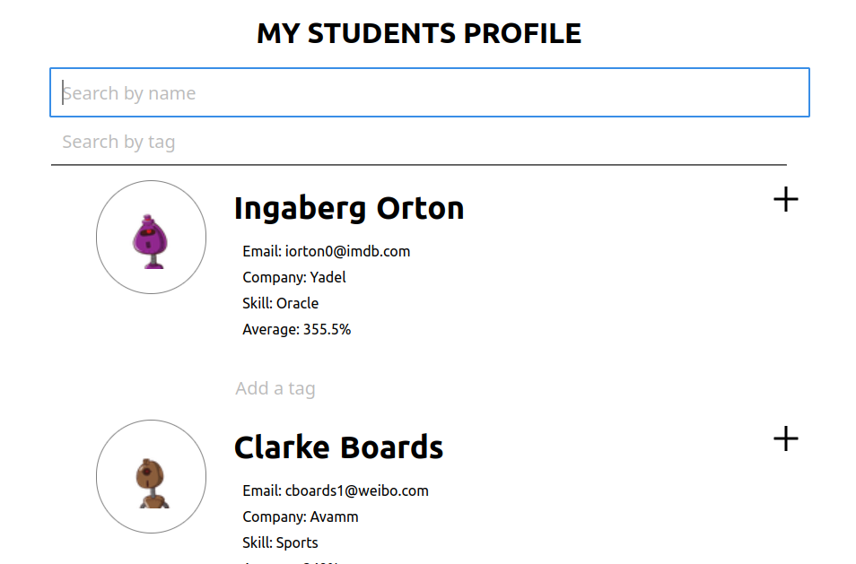

# Students Profile

Students-Profile is a mobile responsive app that fetch data from public JSON API, and present
the information on the screen. users can filter the list of students
by their name (including full name!). Also each student have an expandable list view, so that all
of their test scores may be viewed. Tere is also a text input field to add tags for a specific student.

## Built With

- Javascript
- React
- axios
- JSX
- HTML
- CSS

## Getting Started

To get a local copy up and running follow these simple example steps.

- Clone the repo git@github.com:Oxford-G/student-profile-hatchways.git
- cd into the root directory
- `npm install` - This will install all the packages in the package.json file
- `npm start` - This will run the app locally in the local environment

## Live link

<!-- [live link](https://secret-meadow-93386.herokuapp.com/ ) -->

## Screenshot

## Author

👤 **Enekwechi Chinonso Gerald**

- GitHub: [@Oxford-G](https://github.com/Oxford-G)
- Twitter: [@OXFORD2](https://twitter.com/OXFOXD2)
- Linkedin: [Enekwechi Chinonso G](https://www.linkedin.com/in/chinonso-enekwechi)

## 🤝 Contributing

Contributions, issues, and feature requests are welcome!

## Show your support

Give a ⭐️ if you like this project!
